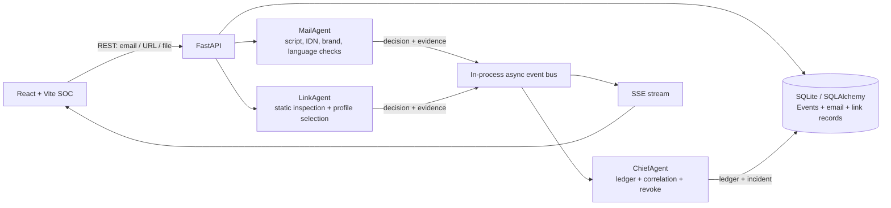

# SentinelMesh architecture

## Agents and event flow

MailAgent and LinkAgent return scored findings with plain-language evidence. The API records the input, decision, and evidence, publishes each action through the in-process asynchronous event bus, and streams new events to connected browsers with SSE. ChiefAgent's decision ledger records decisions and operator overrides. On malicious-link analysis, the ChiefAgent correlation logic checks previously blocked/quarantined sender domains and creates a CRITICAL incident when the domain matches. Revocation releases the message to Inbox, marks the ledger entry REVOKED with operator and timestamp, and adds the sender to the allowlist.

### Stored records

- `emails`: sender fields, message text, verdict, score, evidence, folder, and revoke state.
- `link_scans`: URL/file target, findings, verdict, score, and behavioral-profile report.
- `events`: timestamped agent actions, persisted before being emitted to SSE subscribers.
- `ledger`: ChiefAgent-facing decision history, evidence, status, and revoke attribution.
- `incidents`: severity, combined narrative, timestamp, and linked evidence.
- `allowlist`: senders released by an operator.

## Limitations and Future Work

The sandbox is simulated. It selects one of four prebuilt profiles and renders a synthetic CPU/memory timeline, process tree, network log, file and persistence changes, backdoor indicator, and honeypot interactions. It does not run code, contact hosts, or alter the machine. Static checks and lightweight keyword scores are educational heuristics and can produce false positives or miss new attack patterns. The demo uses a local SQLite database and an in-process event bus, so it is intended for a single-user local evaluation.

A production version would integrate Gmail API or Microsoft Graph API for mail access, and Cuckoo/CAPE or Firecracker for isolated real detonation. It would also need hardened identity and authorization, durable distributed messaging, audit retention, safe file handling, threat-intelligence updates, and security review.
